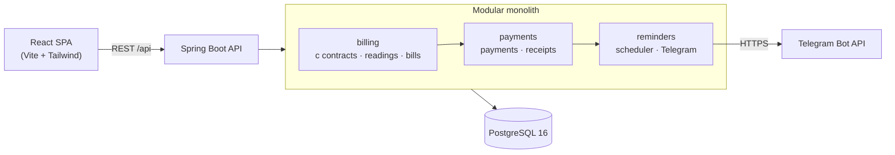

<div align="center">


# Room Management

**Track your rental room like a pro — contracts, electricity bills, payments, receipts and Telegram reminders in one place.**

English · [Tiếng Việt](README.vi.md)


</div>

---

A personal, mobile-first app for a single landlord: store one active rental contract, log monthly electricity meter readings, generate immutable bills, confirm payments with uploadable transfer receipts, and get automatic Telegram reminders before due dates — plus automatic contract termination on the 4th day of non-payment.


## 📑 Table of Contents

- [✨ Features](#-features)
- [📸 Screenshots](#-screenshots)
- [🏗️ Architecture](#️-architecture)
- [🧮 Business Rules](#-business-rules)
- [🚀 Getting Started](#-getting-started)
  - [Prerequisites](#prerequisites)
  - [Run with Docker](#run-with-docker)
  - [Run in Development Mode](#run-in-development-mode)
- [🔌 API Overview](#-api-overview)
- [🧪 Testing](#-testing)
- [📱 Telegram Setup](#-telegram-setup)
- [🔐 Security Notes](#-security-notes)
- [⚠️ MVP Limitations](#️-mvp-limitations)
- [💼 CV Highlights](#-cv-highlights)

## ✨ Features

- **One active contract** — rent, electricity unit price, fixed water & service fees, monthly payment due day (1–28), all stored once.
- **Electricity readings** — one reading per billing period (`YYYY-MM`), validated to be consecutive and never lower than the previous one.
- **Snapshot bills** — every bill stores its own copy of prices, meter values and consumption. Later contract changes never rewrite history.
- **Payments** — a bill can be paid exactly once. Idempotency is enforced with an `Idempotency-Key` header plus a SHA-256 payload hash (same key + different payload → `422`).
- **Receipts** — upload one JPEG/PNG/WebP transfer receipt (≤ 5 MB) per payment. The backend validates magic bytes, never trusts client MIME types, stores files under a UUID name and blocks path traversal.
- **On-time tracking** — a payment is on time through the end of the due date, computed in `Asia/Ho_Chi_Minh`.
- **Telegram reminders** — daily 09:00 job (Asia/Ho_Chi_Minh) sends configurable reminders 7/3/1 days before the due date, on overdue days 1–3, warns about termination, terminates the contract on overdue day 4 and confirms it via Telegram, and reminds 60/30 days before contract expiry.
- **Deduplication & retry** — every reminder is deduplicated by (type, reference, target date, channel) in the database; failed sends are retried up to 3 times with a 2-day backoff inside a 7-day window.

## 📸 Screenshots

| Desktop dashboard | Bill breakdown (mobile) | Reminder settings (desktop) |
| --- | --- | --- |
|  |  |  |

## 🏗️ Architecture

A modular monolith backend plus a thin React SPA. Modules communicate in one direction: `billing → payments → reminders`.



- **`billing`** — contracts, electricity readings, bills (the single source of truth for money).
- **`payments`** — payment confirmation (idempotent) and receipt storage/streaming.
- **`reminders`** — reminder settings, the daily dispatch job, reminder history, Telegram adapter.
- **`common`** — shared structured error handler (`{ error: { code, message, details } }`) and the business time zone.

```
backend/src/main/java/com/khoa/roommanagement/
├── billing/            # contracts · electricity · bills
├── payments/           # payments · receipts
├── reminders/          # settings · dispatch job · telegram adapter
└── common/             # error handling · business time zone

frontend/src/
├── app/                # App composition + workspace orchestration hook
├── components/         # generic forms · data display · feedback
├── features/           # contracts · bills · payments · receipts · settings · reminders
└── shared/             # API client · date/format helpers · Tailwind tokens
```

All database changes go through [Flyway](https://flywaydb.org) migrations (`V1`–`V8`).

## 🧮 Business Rules

- **Bill total** = `rent + consumption × electricity unit price + fixed water fee + fixed service fee`, where `consumption = new meter − previous meter`.
- A new reading must be **consecutive** with the previous period and **≥** the previous meter value.
- Bills are created per period only once (`409 DUPLICATE_BILL`).
- `paidAt` must lie **within the bill's period** and not in the future; payment is **on time** through the end of the due date (`Asia/Ho_Chi_Minh`).
- **Overdue day 1–3** → warning reminders; **overdue day 4** → contract becomes `TERMINATED_FOR_NON_PAYMENT` (blocks new payments, bills and readings) and exactly one termination notification is sent.

## 🚀 Getting Started

### Prerequisites

| Tool | Version |
| --- | --- |
| [Docker Desktop](https://www.docker.com/products/docker-desktop/) | any recent version |
| Java 21 + Maven (only for backend dev mode) | 21 |
| Node.js (only for frontend dev mode) | 20+ |

### Run with Docker

```bash
# 1. Clone
git clone https://github.com/Khoa180806/RoomManagement.git
cd RoomManagement

# 2. Configure environment
cp .env.example .env        # Windows: copy .env.example .env
#    → set POSTGRES_PASSWORD to a local-only password

# 3. Start everything
docker compose up --build -d
```

When all containers are healthy:

- 🖥️ Web UI: <http://localhost:8080>
- ❤️ API health: <http://localhost:8081/actuator/health>

Data survives restarts: `postgres-data` and `receipts-data` are named volumes.

| Variable | Purpose | Default |
| --- | --- | --- |
| `POSTGRES_DB` / `POSTGRES_USER` / `POSTGRES_PASSWORD` | database credentials | see `.env.example` |
| `BACKEND_PORT` / `FRONTEND_PORT` | host ports | `8081` / `8080` |
| `TELEGRAM_BOT_TOKEN` / `TELEGRAM_CHAT_ID` | Telegram reminders (optional) | empty → reminders disabled |
| `APP_REMINDERS_CRON` | override the 09:00 job schedule (testing only) | `0 0 9 * * *` |

### Run in Development Mode

Backend (from `backend/`):

```bash
# needs a local PostgreSQL; DATABASE_URL/USERNAME/PASSWORD env vars or defaults
./mvnw spring-boot:run
```

Frontend (from `frontend/`):

```bash
npm ci
npm run dev        # http://localhost:5173, proxies /api → :8081
```

## 🔌 API Overview

All errors share one structured format:

```json
{ "error": { "code": "DUPLICATE_BILL", "message": "…", "details": [] } }
```

| Method | Path | Purpose |
| --- | --- | --- |
| `GET` | `/api/contracts/active` | Current active contract (`404` before setup) |
| `POST` | `/api/contracts` | Create the contract |
| `POST` | `/api/electricity-readings` | Log a meter reading for a period |
| `GET` | `/api/electricity-readings` | List readings (filter by `period`) |
| `POST` | `/api/bills` | Issue a bill from two readings |
| `GET` | `/api/bills` | Paginated bills (filter by `period`) |
| `POST` | `/api/bills/{id}/payments` | Confirm payment (`Idempotency-Key` header) |
| `GET` | `/api/payments` | Paginated payment history (`onTime` filter) |
| `POST` | `/api/payments/{id}/receipts` | Upload receipt (multipart) |
| `GET` | `/api/receipts/{id}` | Stream the receipt image |
| `GET` / `PUT` | `/api/reminder-settings` | Read / update reminder schedule |
| `GET` | `/api/reminders` | Reminder history (paginated) |
| `POST` | `/api/reminders/test` | Send a Telegram test message |
| `GET` | `/actuator/health` | Health probe |

## 🧪 Testing

```bash
# Backend — 100 unit/integration tests
./mvnw test

# Frontend — 21 unit/component tests (Vitest + Testing Library)
npm --prefix frontend run test

# Lint & production build
npm --prefix frontend run lint
npm --prefix frontend run build
```

Covered areas: billing formulas and edge cases, single-active-contract rule, payment idempotency (422/409 paths), on-time boundaries with a fixed clock, receipt magic bytes/size/traversal, reminder scheduling with a fixed clock, backoff/retry, dedupe constraint, and frontend validation/components.

## 📱 Telegram Setup

1. Create a bot with [@BotFather](https://t.me/BotFather) → copy the token.
2. Message your bot once, then get your chat ID from [@userinfobot](https://t.me/userinfobot).
3. Put both into `.env` (`TELEGRAM_BOT_TOKEN`, `TELEGRAM_CHAT_ID`) and restart: `docker compose up -d backend`.
4. Open the web UI → **Telegram nhắc hạn** → *Gửi tin nhắn thử* and check your chat.

The token never appears in logs, API responses or error messages — only inside the outbound call URL to Telegram.

## 🔐 Security Notes

- ⚠️ **Single-user MVP without authentication.** Do not expose this app to the internet before adding auth.
- Uploads are validated server-side: magic bytes (JPEG/PNG/WebP), 5 MB limit, UUID file names, path-traversal guard, files streamed from a private volume — never a DB BLOB, never a client-controlled path.
- Money is stored as integers (VND) — no floating point.
- Secrets live only in `.env` (git-ignored). Structured errors never leak stack traces or filesystem paths.

## ⚠️ MVP Limitations

- No authentication/authorization yet (Phase 2).
- History pagination is partly client-side; no server-side search.
- One receipt per payment, one active contract, single landlord — by design.
- Reminder settings are global (single user).

## 💼 CV Highlights

Interview-ready write-ups of the trickiest parts (billing snapshots, payment idempotency, the reminder scheduler and upload hardening) live in [docs/CV-HIGHLIGHTS.md](docs/CV-HIGHLIGHTS.md).
