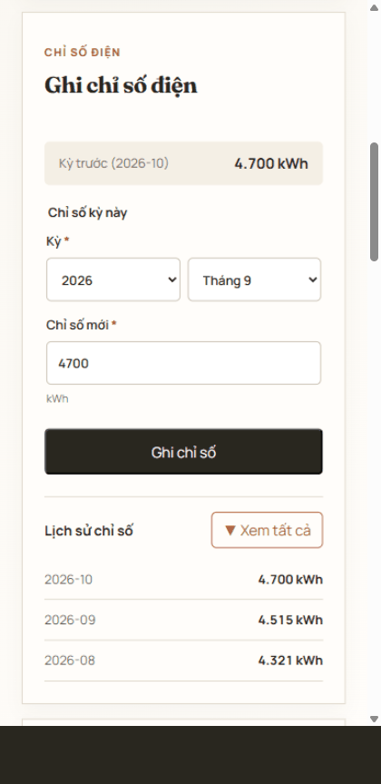
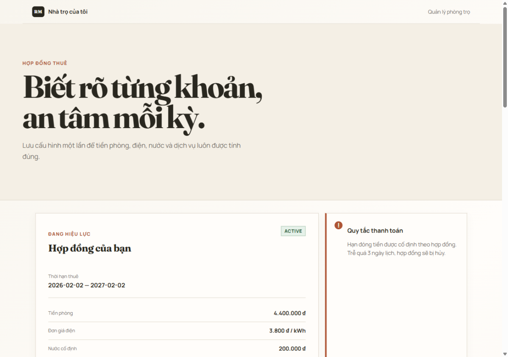
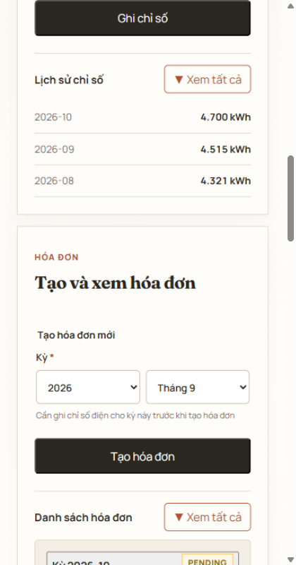
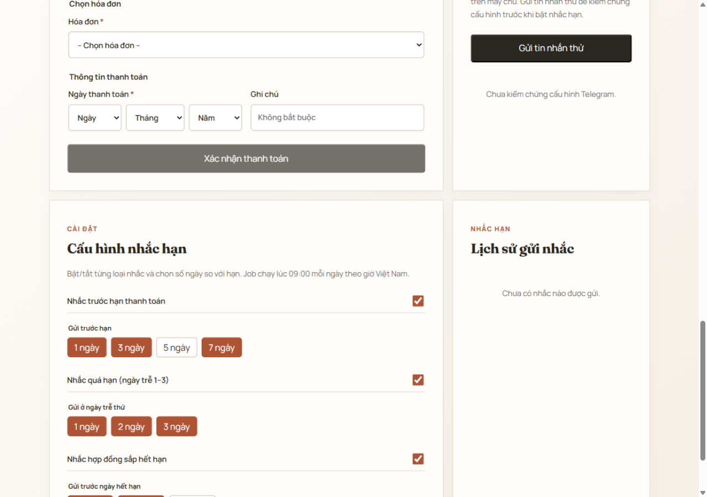
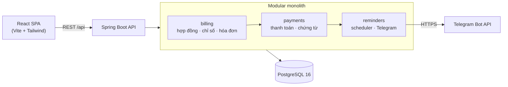

<div align="center">


# Quản Lý Phòng Trọ

**Quản lý phòng trọ chuyên nghiệp — hợp đồng, hóa đơn điện, thanh toán, chứng từ và nhắc hạn Telegram trong một ứng dụng.**

[Tiếng Việt](README.vi.md) · English


</div>

---

Ứng dụng cá nhân, tối ưu cho điện thoại, dành cho một chủ trọ: lưu một hợp đồng thuê đang hiệu lực, ghi chỉ số điện hằng tháng, phát hành hóa đơn bất biến, xác nhận thanh toán kèm ảnh chuyển khoản, và nhận nhắc hạn tự động qua Telegram — kể cả tự hủy hợp đồng khi trễ hạn sang ngày thứ tư.



## 📑 Mục Lục

- [✨ Tính Năng](#-tính-năng)
- [📸 Ảnh Minh Họa](#-ảnh-minh-họa)
- [🏗️ Kiến Trúc](#️-kiến-trúc)
- [🧮 Quy Tắc Nghiệp Vụ](#-quy-tắc-nghiệp-vụ)
- [🚀 Chạy Dự Án](#-chạy-dự-án)
  - [Yêu cầu](#yêu-cầu)
  - [Chạy bằng Docker](#chạy-bằng-docker)
  - [Chạy ở chế độ phát triển](#chạy-ở-chế-độ-phát-triển)
- [🔌 Tổng Quan API](#-tổng-quan-api)
- [🧪 Kiểm Thử](#-kiểm-thử)
- [📱 Cấu Hình Telegram](#-cấu-hình-telegram)
- [🔐 Lưu Ý Bảo Mật](#-lưu-ý-bảo-mật)
- [⚠️ Giới Hạn MVP](#️-giới-hạn-mvp)
- [💼 Nội Dung CV](#-nội-dung-cv)

## ✨ Tính Năng

- **Một hợp đồng hiệu lực** — tiền phòng, đơn giá điện, tiền nước/phí dịch vụ cố định, ngày đến hạn hằng tháng (1–28), lưu một lần.
- **Chỉ số điện** — tối đa một chỉ số cho mỗi kỳ (`YYYY-MM`), phải liên tiếp kỳ trước và không nhỏ hơn chỉ số cũ.
- **Hóa đơn snapshot** — mỗi hóa đơn lưu bản sao giá, chỉ số và mức tiêu thụ riêng. Sửa giá hợp đồng sau này không đổi quá khứ.
- **Thanh toán** — mỗi hóa đơn chỉ thanh toán đúng một lần. Idempotency qua header `Idempotency-Key` kèm hash SHA-256 nội dung (cùng key khác nội dung → `422`).
- **Chứng từ** — tải một ảnh JPEG/PNG/WebP (≤ 5 MB) cho mỗi thanh toán. Backend kiểm tra magic bytes, không tin MIME client, lưu tên UUID và chặn path traversal.
- **Đúng hạn/trễ hạn** — thanh toán trong cả ngày đến hạn vẫn tính đúng hạn, tính theo `Asia/Ho_Chi_Minh`.
- **Nhắc hạn Telegram** — job chạy 09:00 hằng ngày (giờ VN): nhắc trước hạn 7/3/1 ngày, nhắc quá hạn ngày trễ 1–3 kèm cảnh báo, tự hủy hợp đồng ngày trễ thứ 4 và gửi xác nhận, nhắc trước ngày hết hạn hợp đồng 60/30 ngày.
- **Chống gửi trùng & retry** — mỗi reminder dedupe theo (loại, đối tượng, ngày dự kiến, kênh) ngay ở database; gửi lỗi thử lại tối đa 3 lần, backoff 2 ngày, trong cửa sổ 7 ngày.

## 📸 Ảnh Minh Họa

| Dashboard máy tính | Chi tiết hóa đơn (mobile) | Cấu hình nhắc (desktop) |
| --- | --- | --- |
|  |  |  |

## 🏗️ Kiến Trúc

Backend dạng modular monolith, frontend là React SPA mỏng. Các module phụ thuộc một chiều: `billing → payments → reminders`.



- **`billing`** — hợp đồng, chỉ số điện, hóa đơn (nguồn duy nhất của số tiền).
- **`payments`** — xác nhận thanh toán (idempotent) và lưu/stream chứng từ.
- **`reminders`** — cấu hình nhắc, job gửi hằng ngày, lịch sử reminder, adapter Telegram.
- **`common`** — handler lỗi có cấu trúc dùng chung (`{ error: { code, message, details } }`) và múi giờ nghiệp vụ.

```
backend/src/main/java/com/khoa/roommanagement/
├── billing/            # contracts · electricity · bills
├── payments/           # payments · receipts
├── reminders/          # settings · dispatch job · telegram adapter
└── common/             # error handling · business time zone

frontend/src/
├── app/                # Ghép layout + hook điều phối workspace
├── components/         # form · hiển thị dữ liệu · feedback dùng chung
├── features/           # contracts · bills · payments · receipts · settings · reminders
└── shared/             # API client · helper ngày/tiền · Tailwind tokens
```

Mọi thay đổi database đi qua migration [Flyway](https://flywaydb.org) (`V1`–`V8`).

## 🧮 Quy Tắc Nghiệp Vụ

- **Tổng hóa đơn** = `tiền phòng + tiêu thụ × đơn giá điện + tiền nước cố định + phí dịch vụ cố định`, với `tiêu thụ = chỉ số mới − chỉ số cũ`.
- Chỉ số mới phải **liên tiếp** kỳ trước và **≥** chỉ số cũ.
- Mỗi kỳ chỉ tạo một hóa đơn (`409 DUPLICATE_BILL`).
- `paidAt` phải nằm **trong kỳ của hóa đơn** và không ở tương lai; thanh toán trong cả ngày đến hạn là **đúng hạn** (`Asia/Ho_Chi_Minh`).
- **Ngày trễ 1–3** → nhắc cảnh báo; **ngày trễ 4** → hợp đồng chuyển `TERMINATED_FOR_NON_PAYMENT` (chặn thanh toán, hóa đơn, chỉ số mới) và gửi đúng một thông báo hủy.

## 🚀 Chạy Dự Án

### Yêu cầu

| Công cụ | Phiên bản |
| --- | --- |
| [Docker Desktop](https://www.docker.com/products/docker-desktop/) | bản mới nhất |
| Java 21 + Maven (chỉ khi chạy backend dev) | 21 |
| Node.js (chỉ khi chạy frontend dev) | 20+ |

### Chạy bằng Docker

```bash
# 1. Tải mã nguồn
git clone https://github.com/Khoa180806/RoomManagement.git
cd RoomManagement

# 2. Tạo file môi trường
copy .env.example .env        # Linux/macOS: cp .env.example .env
#    → đổi POSTGRES_PASSWORD thành mật khẩu local của bạn

# 3. Khởi động toàn bộ
docker compose up --build -d
```

Khi các container đều healthy:

- 🖥️ Giao diện: <http://localhost:8080>
- ❤️ Health API: <http://localhost:8081/actuator/health>

Dữ liệu không mất khi restart nhờ hai volume `postgres-data` và `receipts-data`.

| Biến | Ý nghĩa | Mặc định |
| --- | --- | --- |
| `POSTGRES_DB` / `POSTGRES_USER` / `POSTGRES_PASSWORD` | thông tin database | xem `.env.example` |
| `BACKEND_PORT` / `FRONTEND_PORT` | cổng trên máy host | `8081` / `8080` |
| `TELEGRAM_BOT_TOKEN` / `TELEGRAM_CHAT_ID` | nhắc hạn Telegram (không bắt buộc) | rỗng → tắt nhắc |
| `APP_REMINDERS_CRON` | ghi đè lịch job 09:00 (chỉ để test) | `0 0 9 * * *` |

### Chạy ở chế độ phát triển

Backend (trong thư mục `backend/`):

```bash
# cần PostgreSQL local; đặt DATABASE_URL/USERNAME/PASSWORD hoặc dùng mặc định
./mvnw spring-boot:run
```

Frontend (trong thư mục `frontend/`):

```bash
npm ci
npm run dev        # http://localhost:5173, proxy /api → :8081
```

## 🔌 Tổng Quan API

Mọi lỗi dùng một định dạng có cấu trúc:

```json
{ "error": { "code": "DUPLICATE_BILL", "message": "…", "details": [] } }
```

| Phương thức | Đường dẫn | Mục đích |
| --- | --- | --- |
| `GET` | `/api/contracts/active` | Hợp đồng đang hiệu lực (`404` nếu chưa có) |
| `POST` | `/api/contracts` | Tạo hợp đồng |
| `POST` | `/api/electricity-readings` | Ghi chỉ số điện cho một kỳ |
| `GET` | `/api/electricity-readings` | Danh sách chỉ số (lọc `period`) |
| `POST` | `/api/bills` | Phát hành hóa đơn từ hai chỉ số |
| `GET` | `/api/bills` | Danh sách hóa đơn phân trang (lọc `period`) |
| `POST` | `/api/bills/{id}/payments` | Xác nhận thanh toán (header `Idempotency-Key`) |
| `GET` | `/api/payments` | Lịch sử thanh toán phân trang (lọc `onTime`) |
| `POST` | `/api/payments/{id}/receipts` | Tải chứng từ (multipart) |
| `GET` | `/api/receipts/{id}` | Stream ảnh chứng từ |
| `GET` / `PUT` | `/api/reminder-settings` | Xem / cập nhật lịch nhắc |
| `GET` | `/api/reminders` | Lịch sử gửi nhắc (phân trang) |
| `POST` | `/api/reminders/test` | Gửi tin nhắn thử Telegram |
| `GET` | `/actuator/health` | Health probe |

## 🧪 Kiểm Thử

```bash
# Backend — 100 unit/integration test
./mvnw test

# Frontend — 21 unit/component test (Vitest + Testing Library)
npm --prefix frontend run test

# Lint & build production
npm --prefix frontend run lint
npm --prefix frontend run build
```

Phạm vi kiểm thử: công thức hóa đơn và các biên, luật một hợp đồng active, idempotency thanh toán (422/409), biên đúng hạn với clock cố định, magic bytes/kích thước/path traversal của chứng từ, lịch nhắc với clock cố định, backoff/retry, ràng buộc chống gửi trùng, và validation/component frontend.

## 📱 Cấu Hình Telegram

1. Tạo bot với [@BotFather](https://t.me/BotFather) → lấy token.
2. Nhắn tin cho bot một lần, rồi lấy chat ID qua [@userinfobot](https://t.me/userinfobot).
3. Điền vào `.env` (`TELEGRAM_BOT_TOKEN`, `TELEGRAM_CHAT_ID`) rồi restart: `docker compose up -d backend`.
4. Mở giao diện → **Telegram nhắc hạn** → *Gửi tin nhắn thử* và kiểm tra chat.

Token không bao giờ xuất hiện trong log, response API hay thông báo lỗi — chỉ nằm trong URL gọi ra tới Telegram.

## 🔐 Lưu Ý Bảo Mật

- ⚠️ **MVP một người dùng, chưa có đăng nhập.** Không public ứng dụng trước khi thêm xác thực.
- Upload được kiểm tra tại server: magic bytes (JPEG/PNG/WebP), giới hạn 5 MB, tên file UUID, chặn path traversal, file nằm trong volume riêng — không lưu BLOB trong database, không nhận path từ client.
- Tiền lưu số nguyên (VND) — không dùng số thực.
- Bí mật chỉ nằm trong `.env` (đã git-ignored). Lỗi có cấu trúc không lộ stack trace hay đường dẫn máy.

## ⚠️ Giới Hạn MVP

- Chưa có authentication/authorization (Phase 2).
- Một phần phân trang lịch sử làm phía client; chưa có tìm kiếm server-side.
- Một chứng từ mỗi thanh toán, một hợp đồng active, một chủ trọ — là chủ đích thiết kế.
- Cấu hình nhắc là toàn cục (một người dùng).

## 💼 Nội Dung CV

Các đoạn mô tả sẵn để đưa vào CV/phỏng vấn (business logic, scheduler, Telegram, bảo mật upload) nằm ở [docs/CV-HIGHLIGHTS.md](docs/CV-HIGHLIGHTS.md).
